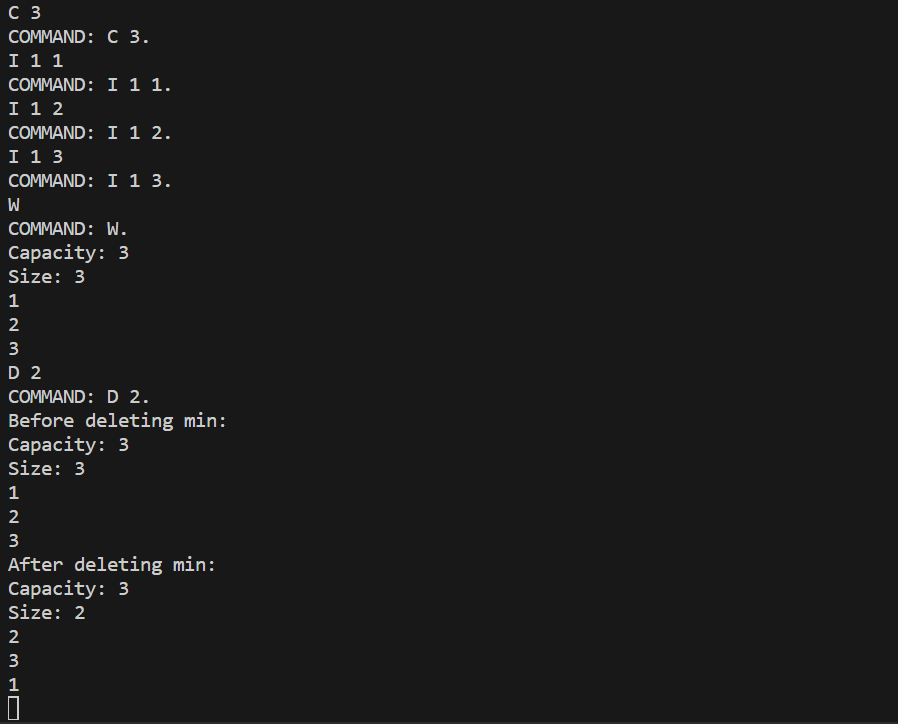

# Min-Heap

## Preview:

**Note:** this program has only been compiled and tested on a linux based machine

**How to use the program:**     
The program takes the following inputs from the keyboard: 

S:       
On reading "S" the program stops.        

C n:    
on reading "C n" the program creates an empty heap with capacity equal to "n" and waits for the next command.        
-Ex: "C 5" will create an empty heap with a capacity of 5.     

R:      
On reading "R" the program reads in the array from the HEAPinput.txt file and creates a heap from the values in HEAPinput.txt by calling the linear time build heap algorithm and waits for the next command.     

W:      
on reading "W" the program writes the current heap information to the screen, and waits for the next command.    

I f k:       
On reading "I f k" the program inserts an element with key equal to "k" into the current heap. If "f" is set to 2 the program prints out the heap contents before and after the insertion, and if "f" is set to 1 the program does not do any additional printing. The program then waits for the next command.        
-Ex: "I 2 5" will insert an element with key 5 into the heap and print the heap before and after insertion.  

D f:    
On reading "D f" the program deletes the element with minimum key from the heap. If "f" is set to 2 the program prints out the heap contents before and after the deletion, and if "f" is set to 1 the program does not do any additional printing. The program then waits for the next command.        
-Ex: "D 1" will delete the element with minimum key and won't print the heap.  

K f i v:    
On reading "K f i v" the program decreases the key of element with index "i" to "v". If "f" is set to 2 the program prints out the heap contents before and after the operation, and if "f" is set to 1 the program does not do any additional printing. The program then waits for the next command.      
-Ex: "K 2 3 1" will decrease the key of element 3 to 1.

**HEAPinput.txt file:**     
The first number in the file will be the arrays size followed by the values in the array.     
Example HEAPinput.txt file:     
4   
1   
2   
3   
4   

**Program:**        
This program creates a min-heap with several functions, like initialize, build heap, insert, delete min, decrease key, and print heap. The program executes these functions based on the user input. S will stop the program, K will decrease key, R will build a heap, W will print the heap, C will initialize the heap, I will insert an element into the heap, and D will delete the minimum value in the heap. The program will continue to run until the user inputs S. 

**Running the program:**    
To run the program the user must first input "make" into the terminal to compile the files. Then the user must input "./run" in the terminal to run the program. The program is now open and the user can call any of the functions from the program. Some functions will need additional values to execute. K will need three additional values, the flag the index and the value. C will need one additional value for the capacity of the heap. I will need two additional values for the flag and key. D will need one additional value for the flag.

**Functions:**      
Initialize:          
The initialize function takes in and int as a parameter and returns a heap. This function initializes the heap with whatever value the user has passed in.

BuildHeap:         
The build heap function takes in a heap pointer, an element array, and an integer as parameters.This functions builds a heap with the element array passed in. 

Insert:          
The insert function takes in a heap pointer and two integers as parameters. This function inserts an element at the end of the heap with whatever value the user has specified. The user may also choose to print the heap before and after insert by setting flag to two.

DeleteMin:        
The delete min function takes in a heap pointer and a flag as parameters. This function deletes the element with minimum value and the user may choose to print the heap before and after delete min by setting the flaf to two.

DecreaseKey:        
The decrease key function takes in a heap and three integers as parameters. This function decreases the value of whichever element specified by the user to the value specified by the user.

PrintHeap:         
The print heap function takes in a heap as a parameter. This function prints out all the values in the element array as well as the size and capacity of the heap.

**Files:**      
heap.h:           
This file specifies the heap class as well as all its functions. This file also specifies the element class.

heap.cpp:       
This file implements all the heap functions and handles all of the heap calculations.

util.cpp:       
This file implements the user interface and calls all of the heap functions.

util.h:          
This file specifies the util functions. 

